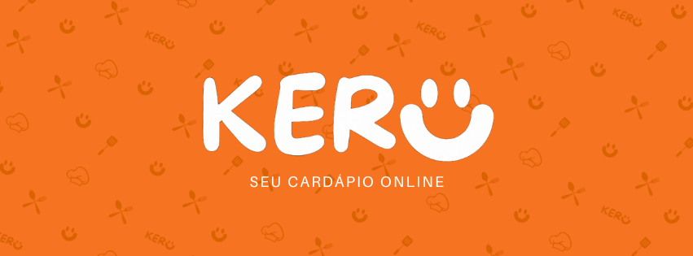

<p align="center">
  
</p>

# KERU

Repositório do **Grupo 02** do Projeto Interdisciplinar do **1º semestre** do curso de **Desenvolvimento de Software Multiplataforma - DSM** (Turma 2026/1).

## 👨‍💻 Integrantes

-   **[Alexsander Gabriel Pires](https://github.com/LostWorlddd)**
-   **[Guilherme Teixeira Ferreira](https://github.com/guilherme-txra)**
-   **[Leonardo de Melo Ernesto](https://github.com/leonardo-meloe)**
-   **[Pietro Reis Dias](https://github.com/PietroReis-07)**

## 📖 Sobre o Projeto

O **KERU** é um cardápio online onde seu principal objetivo é facilitar o processo de pedidos e atendimento, focado na agilidade para o cliente de forma a conseguir realizar o pedido antes mesmo de chegar no local.

🎬 [Assista ao vídeo de apresentação e funcionamento do software](https://youtu.be/M3684vxudC4?si=_1UJL9yYMvNPcmaM)

## Funcionalidades

* Cadastro de usuários
* Login de usuários
* Cadastro de Cardápios
* Interface responsiva
* Armazenamento de dados

## Como Executar

1. Clone o repositório:

   ```bash
   git clone URL_DO_REPOSITORIO
   ```

2. Abra a pasta do projeto.

3. Execute o arquivo `login.html` em seu navegador.

****OBS:** Para testar a funcionalidade completa do projeto é recomendado abrir duas abas, sendo uma como **admin/restaurante** e outra como **user/cliente**

## 🛠️ Tecnologias Utilizadas

### 🎨 Front-end

- **HTML5** - Estrutura das páginas
- **CSS3** - Estilização e responsividade
- **JavaScript** - Interatividade, validações e manipulação do DOM

### 💾 Armazenamento

- **LocalStorage** - Persistência de dados e controle de sessão diretamente no navegador

## Controle de Versão

O projeto utiliza Git e GitHub para controle de versão e colaboração entre os integrantes da equipe.

